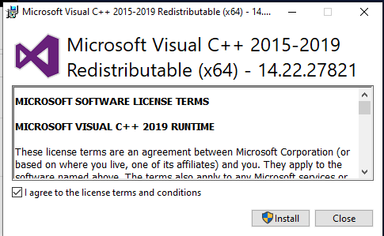
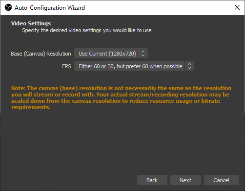
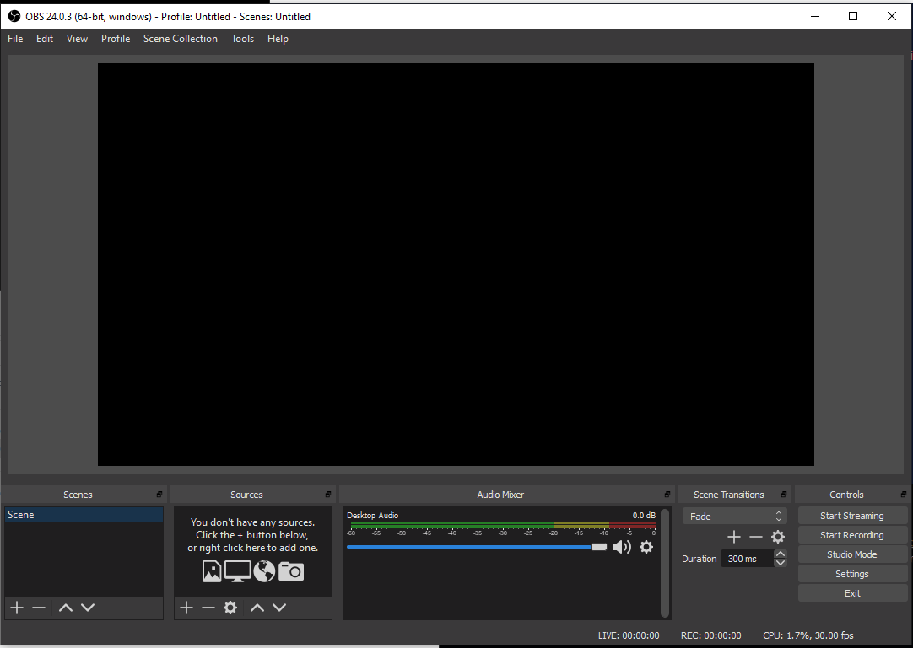

# Applications 2: OBS 

Visit the OBS Software project:

- <https://obsproject.com/>

and install the package for your operating system.

on Windows, if you select the package above an install - you may be forwarded to this page:

If this happens, select the "Visual C++ 2017 Redistributable..." link and download. You will then need to select and run this:

Agree to terms, and Install.

Now you need to have another go at installing OBS - the download should still be in your downloads folder:

Upon completion, it will offer to Launch immediately. Once started, it will present the 'Auto-Configuration Wizard':

Select 'Yes' - and you will see this screen:

Select 'Optimise just for Recording'

You may see these settings:

We can accept these (they can be changed later).

Finally(!) - we get the main OBS dashboard:

